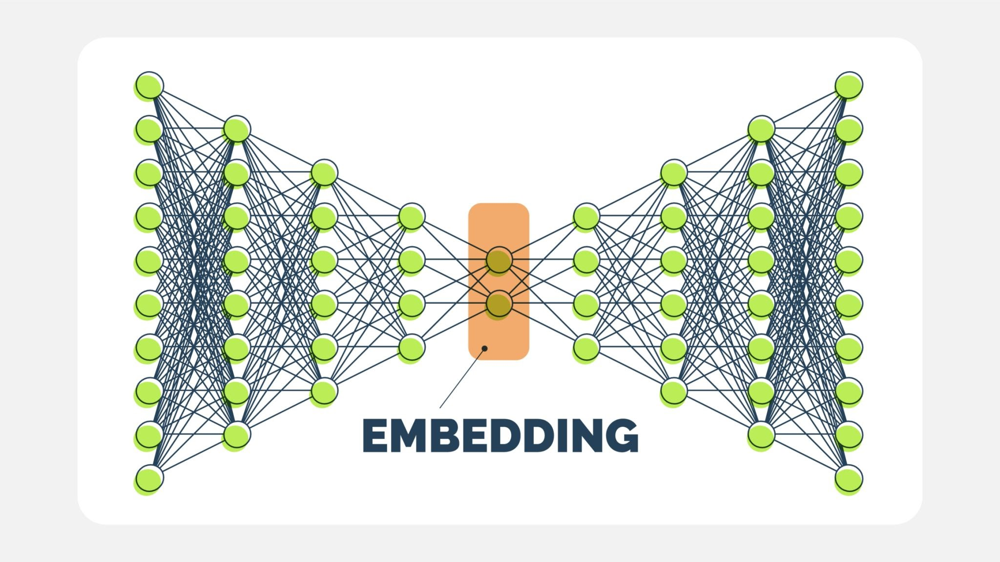

An Autoencoder is a type of neural network that learns to compress data into a short summary (encoding) and then reconstruct it back to its original form (decoding).

For recommendations, it works like this:

Input: We feed the model a user's entire history of movie ratings as a single, sparse vector (e.g., [5, 0, 3, 0, ..., 4], where 0 means unrated).

Encode: The network compresses this long vector into a much smaller, dense vector. This small vector becomes a rich, learned "taste profile" for the user.

Decode: The network then tries to reconstruct the original long vector from this compressed taste profile.

Prediction: In the process of reconstructing, the model is forced to predict the missing ratings. These "filled-in" zeros become our recommendations.

It's a powerful way to learn user preferences and predict ratings for items they haven't seen yet.

## 🛠️ Step 1: Data Preparation for the Autoencoder
The Autoencoder needs the data in a user-item matrix format. Each row will represent a user, each column a movie, and the cells will contain the ratings.